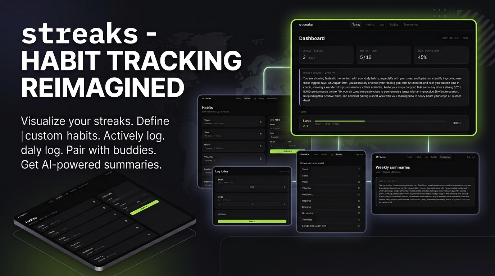

# Streaks

A habit tracker with an accountability buddy, built on [Convex](https://convex.dev).

Define habits, log them daily, watch streaks build, and pair with one accountability buddy who can see your progress (without your raw numbers) and gets nudged with you when you slip. A weekly AI coach summarizes your patterns every Sunday.

## Screenshots



## Features

- **Custom habits** — numeric (steps), duration (sleep hours), or boolean (took vitamins) targets.
- **Daily logging** with type-appropriate controls (steppers, toggle, numeric input).
- **Live streaks** — consecutive-day counts computed reactively, no polling.
- **Accountability buddy** — invite-code pairing; your buddy sees hit/miss status per habit, not your raw values.
- **Weekly AI coach** — a Gemini-generated summary of your week's patterns, posted every Sunday via cron.
- **Missed-log nudges** — an hourly cron pings a Discord webhook for anyone who hasn't logged that day.
- **GitHub sign-in** via Convex Auth.
- Fully reactive UI — every screen updates live across tabs/devices with no manual refresh.

## Tech stack

| Layer      | Choice                                                             |
|------------|---------------------------------------------------------------------|
| Backend    | [Convex](https://convex.dev) — database, server functions, cron jobs, auth |
| Frontend   | Next.js (App Router) + React + TypeScript                          |
| Styling    | Tailwind CSS v4 + [shadcn/ui](https://ui.shadcn.com) (Radix primitives) |
| Auth       | [Convex Auth](https://labs.convex.dev/auth) (GitHub OAuth)          |
| AI         | Google Gemini (`@google/generative-ai`) for weekly summaries        |
| Icons      | [lucide-react](https://lucide.dev)                                  |

## Prerequisites

- Node.js 20+
- A free [Convex](https://convex.dev) account
- A [GitHub OAuth App](https://github.com/settings/developers) for sign-in
- (Optional) A [Google AI Studio](https://aistudio.google.com/) API key, for weekly AI summaries
- (Optional) A Discord webhook URL, for missed-log nudges

## Getting started

### 1. Clone and install

```bash
git clone <this-repo-url>
cd habit-tracker
npm install
```

### 2. Set up Convex

```bash
npx convex dev
```

On first run this creates a Convex project (or links an existing one), and writes `NEXT_PUBLIC_CONVEX_URL` / `CONVEX_DEPLOYMENT` into `.env.local`. **Keep this command running** in its own terminal while you develop — it watches `convex/`, pushes function changes live, and regenerates the typed `api` client.

### 3. Configure GitHub sign-in

Create a [GitHub OAuth App](https://github.com/settings/developers):

- **Homepage URL:** `http://localhost:3000`
- **Authorization callback URL:** the value printed by `npx convex dev` as your deployment's site URL, suffixed with `/api/auth/callback/github` (e.g. `https://<your-deployment>.convex.site/api/auth/callback/github`)

Then set the resulting credentials as Convex environment variables:

```bash
npx convex env set AUTH_GITHUB_ID <client-id>
npx convex env set AUTH_GITHUB_SECRET <client-secret>
```

### 4. (Optional) Weekly AI summaries and Discord nudges

```bash
npx convex env set GEMINI_API_KEY <your-key>
npx convex env set DISCORD_WEBHOOK_URL <your-webhook-url>
```

Without these, the app works fine — the weekly summary card just stays empty and the nudge cron becomes a no-op.

### 5. Run the app

In a second terminal (alongside `npx convex dev`):

```bash
npm run dev
```

Open [http://localhost:3000](http://localhost:3000) and sign in with GitHub.

## Available scripts

| Command         | Purpose                                      |
|-----------------|-----------------------------------------------|
| `npm run dev`   | Start the Next.js dev server                  |
| `npm run build` | Production build                              |
| `npm run start` | Serve the production build                    |
| `npm run lint`  | Run ESLint                                     |
| `npx convex dev`| Push Convex functions/schema and watch for changes |

## Project structure

```
habit-tracker/
├── app/
│   ├── layout.tsx            # Root layout: fonts, metadata, auth gate
│   ├── page.tsx               # Dashboard ("/")
│   ├── habits/page.tsx        # Manage habits — list, add, delete
│   ├── log/page.tsx           # Today's log — per-habit entry
│   ├── buddy/page.tsx         # Invite / redeem / view buddy
│   ├── summaries/page.tsx     # Weekly AI summaries history
│   ├── components/            # App-specific React components
│   ├── ConvexClientProvider.tsx
│   └── globals.css            # Tailwind + design tokens
├── components/ui/             # shadcn/ui primitives (button, card, dialog, ...)
├── convex/
│   ├── schema.ts               # Table definitions and indexes
│   ├── habits.ts, logs.ts, buddies.ts, summaries.ts, notifications.ts
│   ├── auth.ts, auth.config.ts # Convex Auth (GitHub) wiring
│   ├── crons.ts                # Scheduled jobs
│   ├── model/                  # Shared backend helpers (streak math, permissions)
│   └── _generated/             # Auto-generated types/API — do not edit
├── lib/                        # Frontend utility functions
└── docs/                       # README assets
```

The split to remember: **everything in `convex/` runs on Convex's servers**; everything in `app/` runs in the browser (or on Next's server for SSR). The bridge is the auto-generated `api` object plus the `useQuery` / `useMutation` hooks.

## Data model

| Table        | Purpose                                                        | Key indexes |
|--------------|------------------------------------------------------------------|-------------|
| `habits`     | One row per habit a user tracks (`name`, `type`, `target`, `unit`) | `by_user` |
| `logs`       | One row per habit per day (`date` as `YYYY-MM-DD`, `value`)      | `by_habit_and_date`, `by_user_and_date` |
| `invites`    | Buddy invite codes (`code`, `createdBy`, `usedBy`)                | `by_code` |
| `buddyPairs` | Confirmed buddy pairings between two users                        | `by_userA`, `by_userB` |
| `summaries`  | Weekly AI-generated coaching summaries (`weekStart`, `text`)      | `by_user_and_week` |

Booleans are stored as `0`/`1` in `logs.value` so every habit type shares the same comparison logic (`value >= target`).

## Testing

There is no automated test suite yet. If you're adding one, [`convex-test`](https://docs.convex.dev/testing/convex-test) is the recommended way to unit-test Convex functions against a simulated backend without a live deployment.

## Deployment

1. Deploy your Convex functions to production: `npx convex deploy`.
2. Deploy the Next.js app to your host of choice (e.g. Vercel), setting `NEXT_PUBLIC_CONVEX_URL` to your production deployment URL.
3. Set the same environment variables from steps 3–4 above on your **production** Convex deployment (`npx convex env set --prod ...`), and update the GitHub OAuth App's callback URL to match production.

## Contributing

Issues and pull requests are welcome.

1. Fork the repo and create a branch from `main`.
2. Make your changes; keep `npx convex dev` running so schema/type errors surface immediately.
3. Run `npm run lint` before opening a PR.
4. Describe what changed and why in the PR description.

## License

[MIT](LICENSE)
