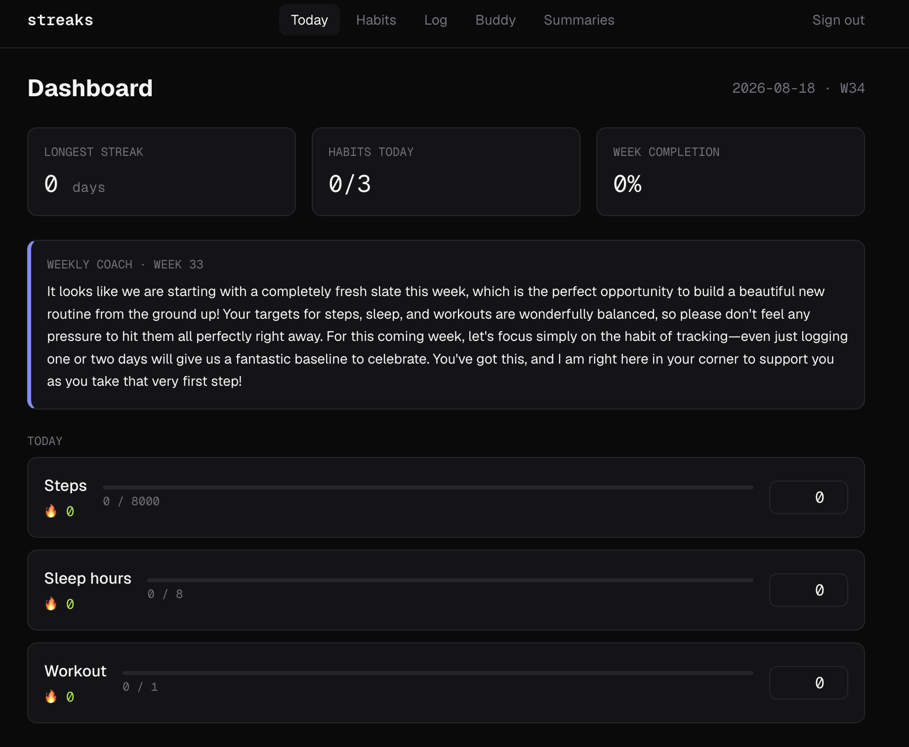

# Streaks

A habit tracker with an accountability buddy, built with [Convex](https://convex.dev).

Log daily habits, watch your streaks grow, and pair with one buddy who sees your progress live and gets nudged when you slip.

## Screenshots



## Stack

- **Backend:** Convex (reactive database, server functions, scheduled jobs)
- **Frontend:** Next.js 15 (App Router) + React + TypeScript
- **Styling:** Tailwind CSS

## Project status

Built incrementally over three days to exercise every major Convex primitive.

- [x] **Day 1** — Foundations: schema, queries, mutations, reactive UI
- [ ] **Day 2** — Streaks (computed reactive queries), cron jobs, actions, external notifications
- [ ] **Day 3** — Auth (Clerk), buddy pairing, permission helpers, AI-generated weekly summary

## What works today (end of Day 1)

- Define custom habits of three types: `numeric` (e.g. steps), `duration` (e.g. sleep hours), `boolean` (e.g. took vitamins).
- Log a value for each habit for the current day.
- Values persist in Convex and sync live across all open clients — change a value in one browser window and watch it update in another instantly.
- Auth is stubbed with a hardcoded `demo-user`; real auth comes on Day 3.

## Project structure

streaks/
├── convex/
│ ├── _generated/ # Auto-generated types and API — do not edit
│ ├── schema.ts # Tables: habits, logs (+ indexes)
│ └── habits.ts # createHabit, logHabit, listHabits, todayLogs
├── app/
│ ├── layout.tsx # Wraps app in <Providers>
│ ├── providers.tsx # ConvexProvider (Client Component)
│ └── page.tsx # Daily log UI
├── .env.local # NEXT_PUBLIC_CONVEX_URL (created by npx convex dev)
└── package.json


The split to remember: **everything in `convex/` runs on Convex's servers.** Everything in `app/` runs in the browser (or on Next's server for SSR). The bridge is the auto-generated `api` object plus the `useQuery` / `useMutation` hooks.

## Data model

Two tables so far:

**`habits`** — one row per habit the user tracks.

| field    | type                                    | notes                          |
|----------|-----------------------------------------|--------------------------------|
| userId   | string                                  | Hardcoded `demo-user` for now  |
| name     | string                                  | "Steps", "Sleep", "Vitamins"   |
| type     | `"numeric" \| "duration" \| "boolean"`  | Union validator                |
| target   | number                                  | e.g. 8000, 7, 1                |
| unit     | string (optional)                       | "steps", "hours"               |

Index: `by_user` on `[userId]`.

**`logs`** — one row per habit per day.

| field   | type          | notes                       |
|---------|---------------|-----------------------------|
| habitId | id("habits")  | Foreign reference           |
| userId  | string        | Denormalized for fast query |
| date    | string        | ISO date, e.g. `2026-08-13` |
| value   | number        | Booleans stored as 0 or 1   |

Indexes: `by_habit_and_date` on `[habitId, date]`, `by_user_and_date` on `[userId, date]`.

**Design notes:**
- `date` is a `YYYY-MM-DD` string, not a timestamp — makes "today's logs" trivial and avoids timezone bugs at MVP scope.
- One log per habit per day. `logHabit` upserts: it patches an existing row for the day or inserts a new one.
- Indexes are declared upfront because per the Zen of Convex, you use `.withIndex()`, not `.filter()`, for anything that scales.

## Backend functions

All live in `convex/habits.ts`.

| Function       | Kind     | Purpose                                    |
|----------------|----------|--------------------------------------------|
| `createHabit`  | mutation | Insert a new habit for the demo user       |
| `logHabit`     | mutation | Upsert today's value for a given habit     |
| `listHabits`   | query    | All habits for the current user            |
| `todayLogs`    | query    | All logs for a given date, current user    |

Mutations are automatically transactional — no `BEGIN`/`COMMIT`. Queries are pure and reactive — subscribing clients get pushed updates when underlying data changes.

## Getting started

**Prerequisites:** Node 18+, a Convex account (free — sign up at convex.dev).

```bash
# Install deps
npm install

# First-time setup: creates a Convex project, writes .env.local
npx convex dev
```

Then in a second terminal:

```bash
npm run dev
```

Open [http://localhost:3000](http://localhost:3000).

**Keep `npx convex dev` running** while working. It watches the `convex/` folder, pushes changes to your dev deployment on save, and regenerates the typed `api` object.

## Seeding data

Since there's no habit-creation UI yet, use the Convex dashboard at [dashboard.convex.dev](https://dashboard.convex.dev):

1. Open your project → Functions → `habits:createHabit` → Run function.
2. Call it three times with example args:

```json
{ "name": "Steps",    "type": "numeric",  "target": 8000, "unit": "steps" }
{ "name": "Sleep",    "type": "duration", "target": 7,    "unit": "hours" }
{ "name": "Vitamins", "type": "boolean",  "target": 1 }
```

3. Reload `localhost:3000` — the three habits appear with inputs.

## The Day 1 "aha" moment

Open `localhost:3000` in two browser windows side by side. Change a value in one — the other updates instantly, no refresh, no polling. That's Convex's reactive subscription in action: `useQuery` opened a WebSocket, the server tracked which data the query read, and when the mutation touched that data, the server re-ran the query and pushed the new result to every subscribed client.

This is the foundation for everything coming in Days 2 and 3.

## What's intentionally missing

Saved for later days so each session covers new ground:

- **Auth** — hardcoded `demo-user` today; real users via Clerk on Day 3.
- **Streaks** — no consecutive-day counting yet; that's the reactive-query showcase on Day 2.
- **Weekly view** — Day 2.
- **Buddy system, invites, notifications** — Day 3.
- **Cron jobs, actions, LLM summaries** — Days 2 and 3.
- **Real styling** — deliberately kept ugly until the data layer is solid.

## Convex concepts covered so far

| Concept                          | Where it lives                          |
|----------------------------------|-----------------------------------------|
| Schema and validators            | `convex/schema.ts`                      |
| Indexes                          | `convex/schema.ts`                      |
| Query functions                  | `convex/habits.ts`                      |
| Mutation functions (transactional) | `convex/habits.ts`                    |
| Reactive client subscriptions    | `useQuery` in `app/page.tsx`            |
| Optimistic mutations             | `useMutation` in `app/page.tsx`         |
| Generated typed API              | `convex/_generated/api`                 |
| ConvexProvider setup             | `app/providers.tsx`                     |
